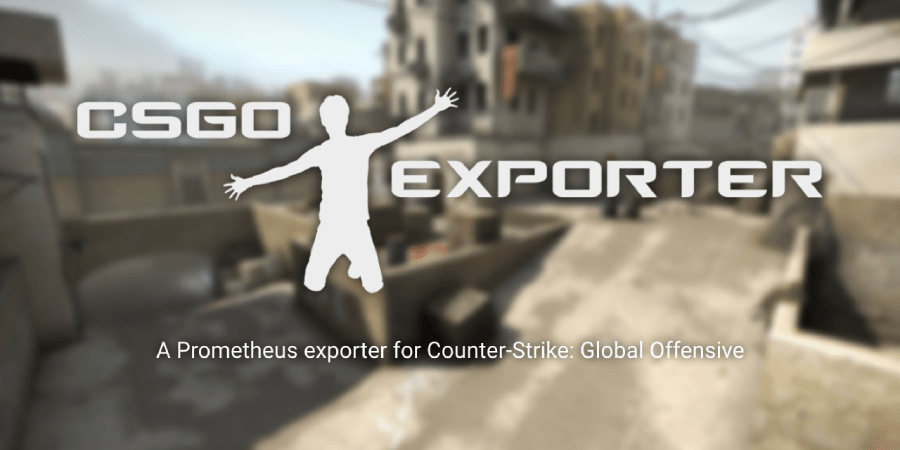
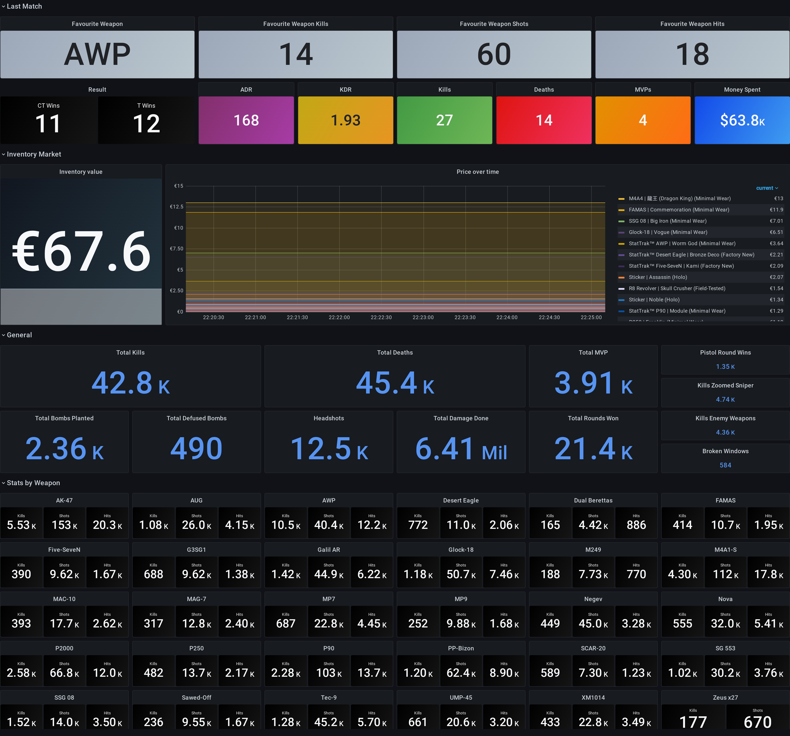

# CSGO Exporter

[][releases]
[][godoc]
[][goreport]
[][codefactor]
[][workflow-c]
[][dockerhub]
[][releases]
[![All Contributors][all_contributors]](#contributors)

This is a Prometheus exporter for [Counter-Strike: Global Offensive][csgo]. It provides statistics from diverse categories, including last matches.

An example of the output of this exporter can be found [here][metrics_example].

## Grafana Dashboard

This wouldn't be an exporter without its corresponding Grafana Dashboard.



This dashboard can be found [here][grafana_dashboard] to be imported to Grafana.

## Prerequisites

One of the two, depending on your running method.

* [Go][go] `>= 1.13`
* [Docker][docker]

## Running this exporter

See [Configuration][configuration] in order to set the necessary params to run the exporter.

### Using a binary

You can download the latest version of the binary built for your architecture [here][releases].

### Using Docker

The exporter is also available as a Docker image in [DockerHub][dockerhub] and [Github CR][ghcr]. You can run it using the following example and pass the configuration as environment variables:

```shell
$ docker run \
  --name csgo_exporter \
  -p 7355:7355 \
  -e STEAM_API_KEY=<your-api-key> \
  -e STEAM_NAME=<your-user-name> \
  -e STEAM_ID=<your-user-id> \
  kinduff/csgo_exporter:latest
```

Alternative, you can use `ghcr.io/kinduff/csgo_exporter` if you want to use the Github Container Registry.

### Using the source

Optionally, you can download and build it from the sources. You have to retrieve the project sources by using one of the following way:

```shell
$ go get -u github.com/kinduff/csgo_exporter
# or
$ git clone https://github.com/kinduff/csgo_exporter.git
```

Install the needed vendors:

```shell
$ GO111MODULE=on go mod vendor
```

Then, build the binary:

```shell
$ go build -o csgo_exporter .
```

## Configuration

You can use both environment variables or parameters in both the binary or the docker image. If you wish to use parameters, simply invoke the same environment variable but in downcase, or use the flag `--help` for more information.

| Environment variable                   | Description                                                                                         | Default                         | Required |
|----------------------------------------|-----------------------------------------------------------------------------------------------------|---------------------------------|----------|
| `HTTP_PORT`                            | The port the exporter will be running the HTTP server                                               | 7355<sup id="a1">[1](#f1)</sup> |          |
| `SCRAPE_INTERVAL`                      | Time in natural format to scrap statistics from the CS:GO APIs                                      | `30s`                           |          |
| `STEAM_API_KEY`                        | Your personal API key from Steam, get one using [this link][steam-api]                              |                                 | Yes      |
| `STEAM_ID` <sup id="a2">[2](#f2)</sup> | The Steam ID you want to fetch the data from for the player statistics                              |                                 | Yes      |
| `STEAM_NAME`                           | If you don't want to provide a `STEAM_ID` you can provide your username, see the footnotes          |                                 |          |
| `FETCH_INVENTORY`                      | Boolean to determine if the exporter should fetch the player's inventory<sup id="a3">[3](#f3)</sup> | `false`                         |          |
| `CURRENCY`                             | The price currency to display the average cost of the player inventory items                        | EUR                             |          |

## Available Prometheus metrics

| Metric name                  | Description                                                                                            |
|------------------------------|--------------------------------------------------------------------------------------------------------|
| `csgo_stats_metric`          | All the stats from the player, it includes last_match data, totals per weapon, among other cool things |
| `csgo_total_kills_metric`    | Total kills from a player per weapon                                                                   |
| `csgo_total_shots_metric`    | Total shots from a player per weapon                                                                   |
| `csgo_total_hits_metric`     | Total hits from a player per weapon                                                                    |
| `csgo_achievements_metric`   | All achievements done by the player, with value `1` or `0` for achieved or not                         |
| `csgo_playtime_metric`       | Hours spent playing the game in minutes in different types, includes stats for each OS                 |
| `csgo_news_metric`           | The latest news from the CS: GO community, can be used in a table. Value is an epoch                   |
| `csgo_user_inventory_metric` | The player's inventory and the cost of each item. Value is the average cost in the desired currency.   |

## Contributors

Thanks goes to these wonderful people who had contributed to the project:

<!-- ALL-CONTRIBUTORS-LIST:START - Do not remove or modify this section -->
<!-- prettier-ignore-start -->
<!-- markdownlint-disable -->
<table>
  <tr>
    <td align="center"><a href="http://blog.simonszu.de"><br /><sub><b>Simon Szustkowski</b></sub></a><br /><a href="#content-simonszu" title="Content">🖋</a></td>
  </tr>
</table>

<!-- markdownlint-restore -->
<!-- prettier-ignore-end -->

<!-- ALL-CONTRIBUTORS-LIST:END -->

## Footnotes

* <b id="f1">[1]</b>: This port is being assigned for fun, since the bomb code from Counter Strike is `7355608`.
* <b id="f2">[2]</b>: Please note that the `STEAM_ID` environment variable is not required if you provide a `STEAM_NAME`, but this will add 1 HTTP call in order to fetch the SteamID.
* <b id="f3">[3]</b>: Inventory should be public, if it's not, the request will fail and the program will exit.

[codefactor]: https://www.codefactor.io/repository/github/kinduff/csgo_exporter
[configuration]: #configuration
[csgo]: https://store.steampowered.com/app/730/CounterStrike_Global_Offensive
[docker]: https://docs.docker.com
[dockerhub]: https://hub.docker.com/r/kinduff/csgo_exporter
[ghcr]: #ghcr
[go]: https://golang.org
[godoc]: https://pkg.go.dev/github.com/kinduff/csgo_exporter
[goreport]: https://goreportcard.com/report/github.com/kinduff/csgo_exporter
[releases]: https://github.com/kinduff/csgo_exporter/releases
[steam-api]: https://steamcommunity.com/dev/apikey
[workflow-c]: https://github.com/kinduff/csgo_exporter/actions/workflows/ci.yml
[metrics_example]: extra/metrics_example.txt
[grafana_dashboard]: extra/grafana_dashboard.json
<!-- ALL-CONTRIBUTORS-BADGE:START - Do not remove or modify this section -->
[all_contributors]: https://img.shields.io/badge/all_contributors-1-orange.svg
<!-- ALL-CONTRIBUTORS-BADGE:END -->
